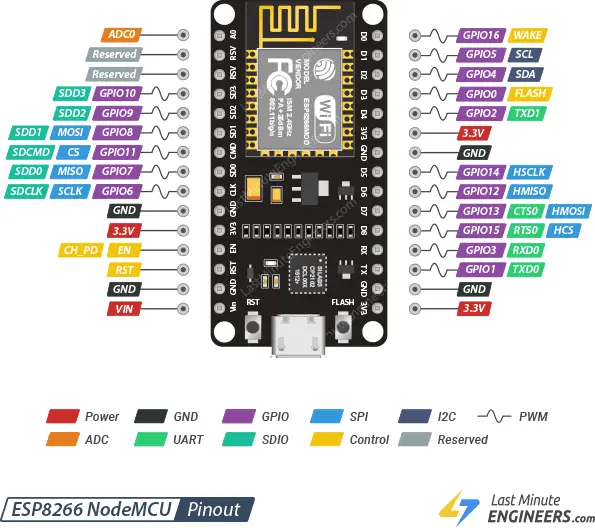

# NodeMCU Amica Module ESP8266MOD

In this project we use the NodeMCU Lua Amica Module V2 ESP8266 from AZ-Delivery:
https://www.az-delivery.de/en/products/nodemcu

# ESP8266 Pinout



# ESP8266 Wireing

ESP8266 D1 -> VL53L0X and DS3231 SDA
ESP8266 D2 -> VL53L0X and DS3231 SCL
ESP8266 3.3V -> VL53L0X and DS3231 VIN
ESP8266 GND -> VL53L0X and DS3231 GND

# VL53L0X Sensor


[Datasheet](./assets/VL53L0X_Time_of_Flight_Sensor_Datenblatt_AZ-Delivery_Vertriebs_GmbH.pdf)

https://www.st.com/en/imaging-and-photonics-solutions/vl53L0x.html
https://www.st.com/en/imaging-and-photonics-solutions/vl6180x.html

https://www.st.com/en/imaging-and-photonics-solutions/time-of-flight-sensors/products.html

https://github.com/pololu/vl53l0x-arduino

[Driver Repository on Github](https://github.com/pololu/vl53l0x-arduino)

# Libs

ESPAsyncTCP.h
ESPAsyncWebServer.h
ArduinoJson.h
VL53L0X.h

# Setup arduino enviroment for VS Code with arduino-cli

Commands to use:

```
arduino-cli core update-index
arduino-cli core upgrade
arduino-cli core install esp8266:esp8266

arduino-cli lib install ESPAsyncTCP
arduino-cli lib install ESPAsyncWebServer
arduino-cli lib install ArduinoJson
arduino-cli lib install VL53L0X

arduino-cli lib update-index
arduino-cli lib list

arduino-cli lib upgrade <library-name>
```

# Filesystem on ESP 8266

This ESP has a flash disk on board. With the LittleFS lib, it is possible to store data on that.
During the boot with this code, we get some info about the capacity and the used storage.

Init LittleFS Filesystem...
LittleFS mounted successfully
Listing directory: /
Filename: data.csv, Size: 319 bytes
Total space:      2072576 bytes
Used space:       24576 bytes
Available space:  2048000 bytes

That's all about around 2 MB of diskspace.

If we assume to have a line of data in our csv-file with about 150 characters, each character typically takes up 1 byte in a standard ASCII encoding. Therefore, each line would take approximately 150 bytes of space. We can then calculate the number of lines that can be stored as follows:

2048000 bytes / 150 bytes/line = appr. 13500 lines

depending on how frequent we store data, the memory will last for x hours of storing data.
Example:

Every 5 sec, that means 60sec/5sec=12 lines a minute we store data.
One hour has 60min, that means 60min*12 lines = 720 lines per hour.

13500 lines / 720 lines per hour = 18,75 hours of storing data.

# HTML 

In order to use Syntax highlighting and IntelliSense from VS Code, we have a sperate [html.html](html.html) in our repo, so we can edit things there and afterwards copy it over to the [html.h](html.h) file. The content of this html file will then be accessible with the variable name *htmlContent* if you include the html.h file in your sources...

# Releases

Find some releases here: https://github.com/lg-lfz/DataRecorder/releases/
They can be flashed with the online flasher https://web.esphome.io/

# GUI

Connect to the open WLAN with the SSID "DataRecorder-*****". After the connection is established, open the webpage http://10.10.10.10. Record your data...

